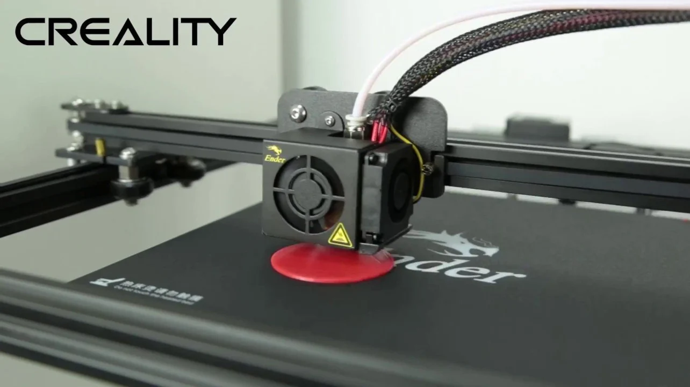

# Pyr0-Piezo Installation Instructions

***Important***: Every printer is different, and this sensor can be adapted to any of them, however we may not currently have a mount designed for your needs. If that's the case, please [open an issue on the github](https://github.com/pyr0ball/pyr0piezo/issues/new?assignees=pyr0ball&labels=add+support+request&template=printer-mount-request.md&title=%5BMOUNT%5D) and/or send us a ping on the discord server.

## Fully Supported Printers

- [Monoprice Delta Mini](tutorials/wiring/easy-piezi/monoprice-delta-mini.md)
  - 

- [Creality Ender 3/5/Pro | CR-10](mounts/creality/creality-original-head.md)
  - 

## Getting Support for your printer

### Request Support using GitHub

Open a [Printer Mount Request](https://github.com/pyr0ball/pyr0piezo/issues/new?assignees=pyr0ball&labels=add+support+request&template=printer-mount-request.md&title=%5BMOUNT%5D)

### Request Support on Discord

Join the [Discord Server](https://discordapp.com/widget?id=544587989536473099&theme=dark) and request support from pyr0ball#2592

### Choosing your mounting scheme
*First, follow the instructions for physically installing your Pyro-Piezo on the printer you're using:*

- Creality:
  - [CR-10 / Ender 3](mounts/creality/creality-original-head.md)
- Prusa / Mendel
  - [Prusa i3 on Head](mounts/prusa-mendel/i3-on-head.md)
  - [Mendel on Head](mounts/mendel/mendel-on-head.md) | [Mendel Gantry Mount](mounts/mendel/mendel-gantry-mount.md)
- Ultimaker Kinematics
  - [Ultimaker Under Bed](mounts/quadrap/um-under-bed.md)
  - [Makerbot Under Bed](mounts/quadrap/makerbot-under-bed.md)
- Core-XY
  - [Hypercube Evo on Head](mounts/core-xy/hevo-on-head.md)
  - [Railcore II Under Bed](mounts/core-xy/railcore-ii.md)
- Delta
  - [Monoprice Delta Mini](mounts/delta/delta-under-bed.md)
  - [Folgertech Delta](mounts/delta/delta-head.md)
- Deltesian
  - [Bornity's Deltesian](mounts/deltesian/deltesian.md)

## Configuring your Printer/Firmware

[Configuring Marlin to use Pyr0-Piezo](tutorials/config/printer-firmware/marlin/marlin-config.md)
