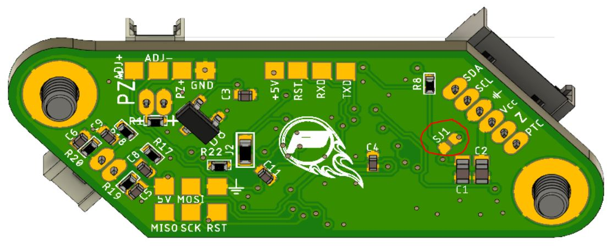
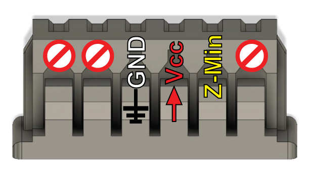
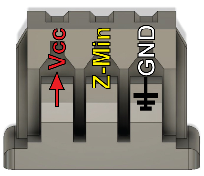

Monoprice Delta Mini Installation
-------------------------------

#### EasyPiezi Wiring:
All of the MPDM's under-bed switch connectors are tied to the same input pin, so only one board connection is required. However, in order to power the EasyPiezi, two solder bridges must be added (a 0Ω resistor also works).

The first must be added to SJ1 on the bottom of the EasyPiezi:



The next must be added to R12 on the MPDM's mainboard, adjacent to the connector used by the EasyPiezi:


Also note the pinouts for each side of the cable. Since the MPDM does not utilize I2C, only the power, ground, and z-min signals are used. If making your own cable, follow these pinouts:

On the EasyPiezi:



On the MPDM's control board:



#### Connecting the piezo disks
Since the EasyPiezi uses a single two-pin input, we need to wire up three piezo disks in parallel (all positive and negative connections are joined together)


#### Mounting the piezo disks
The disks themselves cannot be directly flush with the bottom of the printer's bed, as in that scenario, they will not flex and will not produce any signal. Therefore we need to use strips of double-sided tape on either edge of the disk, or cut a round piece with a hole in the center.


The disks are then mounted under the bed on the inner circumference edges of the pegs.


After that, simply reinstall the bed, being careful not to trap the wires from the piezo between the bed and the printer's case, and plug it all in.

The MPDM can then use multi-point mesh bed leveling by issuing a modified GCODE command:

```
G29 P3 ; 3x3 matrix
G29 P4 ; 4x4 matrix
G29 P5 ; 5x5 matrix
G29 P6 ; 6x6 matrix
```

You can also add one of the above to your startup script in Cura, Slic3r, or Simplify3D
