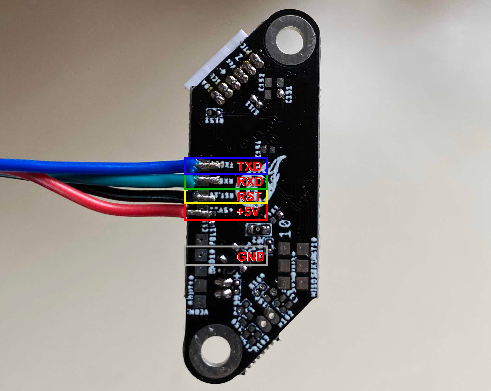

# Pyr0-piezo Beta Unit Firmware Update Procedure

## Utilizing the Pyr0-Piezo AVR Programming Jig

### Physical Construction of the Jig

The AVR Programming jig consists of several components:

- A PCB with USB-UART bridge (or a TTL header)
- A second PCB with ICSP header and Diag Headers installed
- 5MM 3D Printed Standoffs between the two boards
- 0.65mm Diameter Pogo Pins that span the two PCB's
- The three main body components of the jig
- The hinge joints, and clamp
- Hardware:
  - 4x M3 16mm Bolts
  - 5x M3 22mm Bolts

Assembly animation:

<div style='position:relative; padding-bottom:calc(75.00% + 44px)'><iframe src='https://gfycat.com/ifr/AnimatedInsistentChimpanzee' frameborder='0' scrolling='no' width='100%' height='100%' style='position:absolute;top:0;left:0;' allowfullscreen></iframe></div>

---

## Uploading Firmware Without a Jig

Uploading firmware without a Pyr0-Piezo AVR Programming Jig requires soldering to the test pads on the bottom of the Sensor's PCB:



To utilize the UART's in-built auto-reset function, a 10k resistor and a small capacitor must be added to the reset wire in the configuration below:

<object data="../../../schematics/other/USB-UART-Wiring-Example.pdf" type="application/pdf" width="100%" height="450px">
    <embed src="../../../schematics/other/USB-UART-Wiring-Example.pdf">
        <p>This browser does not support PDFs. Please download the PDF to view it: <a href="../../../schematics/other/USB-UART-Wiring-Example.pdf">Download PDF</a>.</p>
    </embed>
</object>

---

## Firmware Upload Procedure

The firmware for this project can be updated using one of three methods: VS Code, Arduino IDE, or avrdude.

Please be sure you've already [wired up your sensor's UART port](../../schematics/other/uart-programmer-wiring.md) or used the programmig jig described earlier in this page.

---

### VS Code (Preferred Application)

#### Installing dependencies

1. Install [VS Code from Micosoft's official page](https://code.visualstudio.com/download)
2. Use the "Extensions" menu to install PlatformIO.
3. (Optional) Install extra plugins to assist in development:
    - GitLense
    - markdownlint
    - Markdown Preview Enhanced
    - C/C++
    - C++ Intellisense
    - Python

#### Configuration

1. In PIO Home, open the firmware folder:
    - `~/pyr0piezo/firmware/AVR-Source/Pyr0_Piezo_sensor_v2.x.x`
2. Make certain you're on the latest `develop` branch
    - In GitLense, under the "Repositories" menu, expand the "Branches" menu
    - Right click on `develop` and select "Switch to Branch"
    - Back at the top of the "Repositories" menu, hover the mouse over `Pyr0_Piezo_Sensor_v2.x.x` and click first on `fetch`, then on `pull`

#### Upload

1. Make any desired adjustments to default values in `src/pP_config.h`
2. Click the "PlatformIO: Upload" button found in the bottom bar of the VS Code window
3. Verify Serial connection by opening the Serial Monitor and typing `CONFIG` or `STATE`. You should get a response.

---

### Arduino IDE

1. Install [Arduino IDE from Arduino's official page](https://www.arduino.cc/en/main/software)
2. Under File > Preferences > Additional Board Manager URL's, Add:
    - `https://mcudude.github.io/MiniCore/package_MCUdude_MiniCore_index.json`

---

### AVRDUDESS

#### Windows (Only)

AVRDUDESS is a GUI version of the avrdude application used for flashing firmware to AVR based MCU's, [and can be found here](https://blog.zakkemble.net/avrdudess-a-gui-for-avrdude/)

After installing AVRDUDESS, and opening it, follow the image below with the settings here:

- **A.** Choose the COM port of your UART programmer from the pulldown menu
- **B.** Ensure "Erase Flash and EEPROM" is checked
- **C.** From the MCU Pulldown, select "Atmega328PB"
- **D.** Set the Fuse Bits to `E2`, `DF`, `F9` respectively. Leave LB *blank*
- **E.** Click the Flash button to begin the upload process

---

### avrdude

#### Windows

1. Install a bash-like terminal. Choose from a number of options:
    - [Windows Subsystem for Linux]
    - [CygWin]
    - [Mingw64]
    - [Git Bash (Comes bundled with Git for Windows)]
2. Download the [avrdude binaries]
3. Extract the binaries somewhere your terminal can find them

#### Linux

##### Ubuntu/Debian Distro's

```bash
sudo apt update && sudo apt install -y avrdude
```

##### Fedora/RHEL/CentOS Distros

```bash
sudo yum install -y avrdude
```
