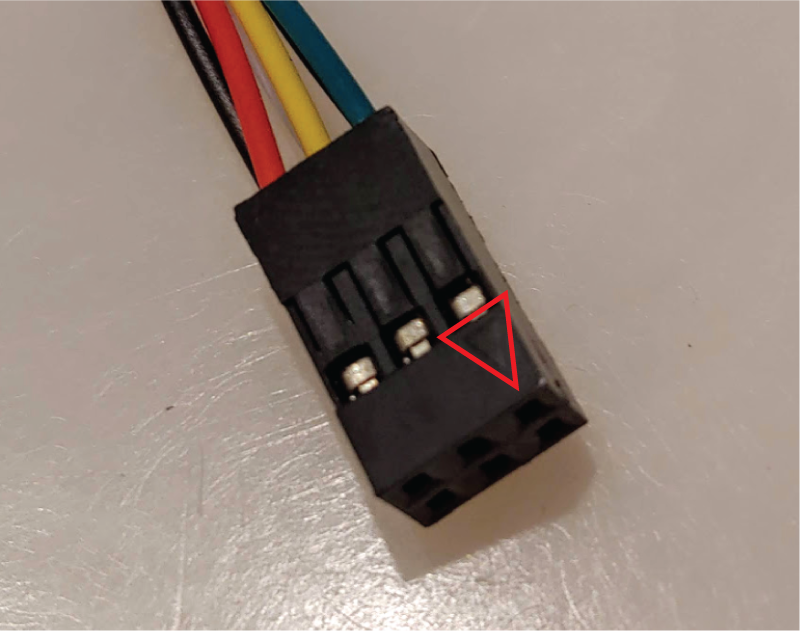
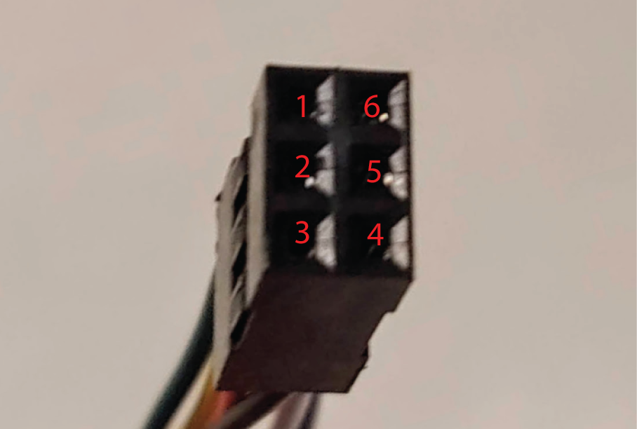
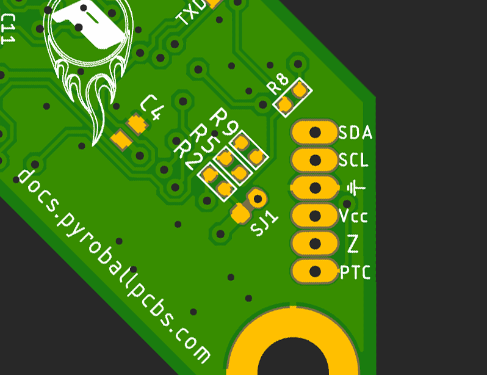

# EasyPiezi Wiring Harness Pinout

## Main Connector Controller Side

The Main Connector for the EasyPiezi has 6 pins, with Pin1 marked with a small embossed arrow:

Pin numbers are laid out in the following image and table:

| Pin Number | Wire Color | Signal Name | Req/Opt |
|------------|------------|-------------|---------|
| 1          | <strong>Green</strong>      | SDA (I2C)   | Optional|
| 2          | <strong>Yellow</strong>     | SCL (I2C)   | Optional|
| 3          | <strong>Red</strong>        | +6-38V DC   | Required|
| 4          | <strong>Black</strong>      | Ground      | Required|
| 5          | <strong>White</strong>      | Z-Trigger   | Required|
| 6          | <strong>Blue</strong>       | PT100 Anlg  | Optional|

## Main Connector Sensor Side

The EasyPiezi's Main Connector Pinout is printed on the bottom of the board:

They are arranged from bottom to top:

| Pin Number | Wire Color | Signal Name | Req/Opt |
|------------|------------|-------------|---------|
| 1          | <strong>Green</strong>      | SDA (I2C)   | Optional|
| 2          | <strong>Yellow</strong>     | SCL (I2C)   | Optional|
| 3          | <strong>Black</strong>      | Ground      | Required|
| 4          | <strong>Red</strong>        | +6-38V DC   | Required|
| 5          | <strong>White</strong>      | Z-Trigger   | Required|
| 6          | <strong>Blue</strong>       | PT100 Anlg  | Optional|