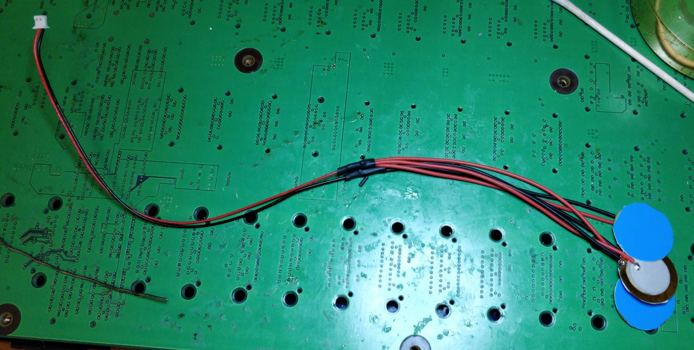
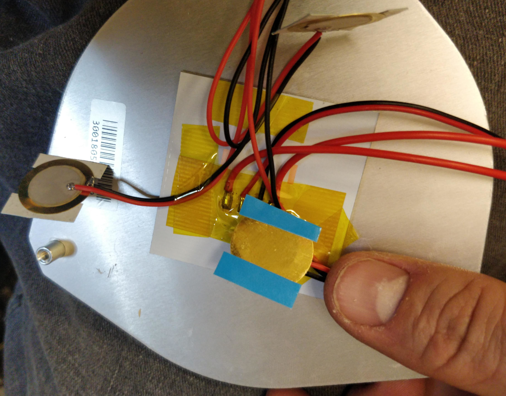
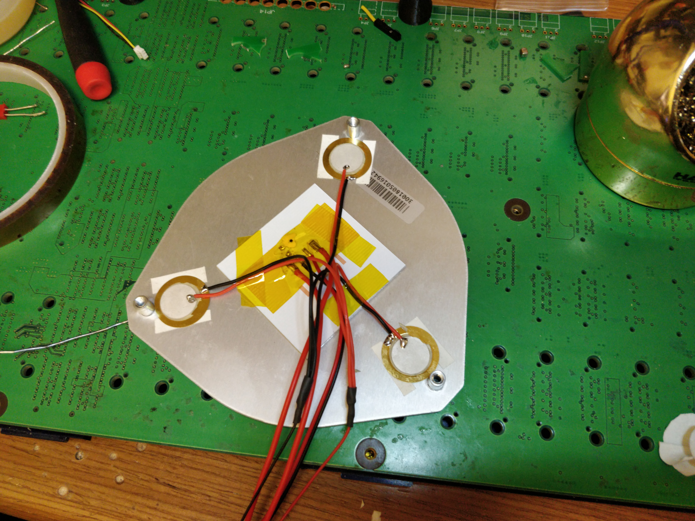
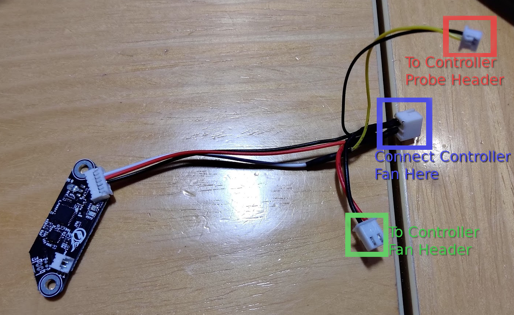
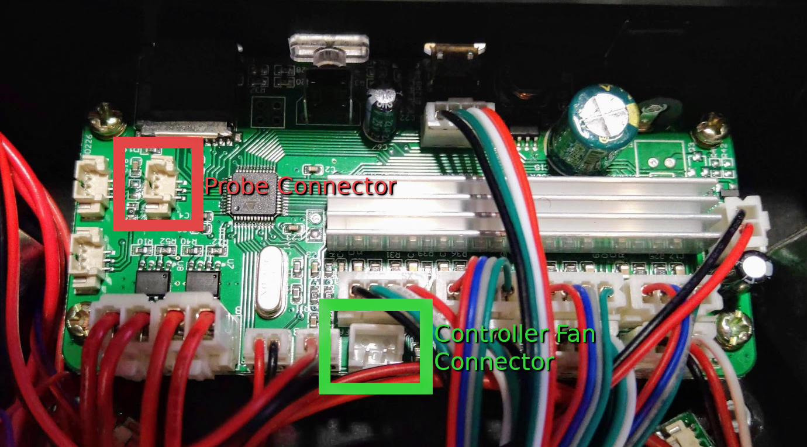
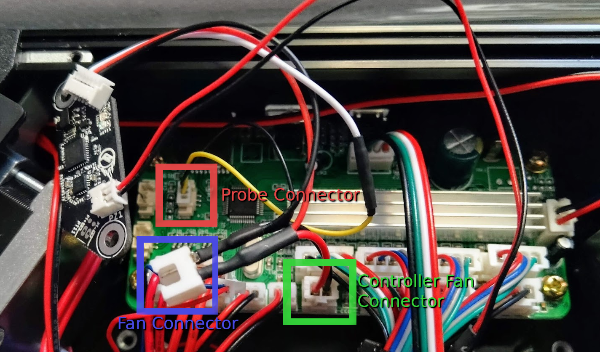

# Monoprice Delta Mini Installation Guide

## Kit Contents

- 1x Pyr0-Piezo Easy-Piezi Board
- 1x MPDM Cable Harness
- 1x 20mm Piezo Array with adhesive tape

---

## Installing the Piezo Array

1. Remove the six M3 screws securing the bottom cover of the printer, and move the cover to the side.
2. Unplug the fan attached to the bottom cover (This is the Controller Fan).
3. Find and unplug the two cables that go through the hole in the center of the printer's baseplate. These are attached to the heated bed.
4. Rotate the three levers holding the heated bed corners to the side. This will release the heated bed, and allow you to lift the bed off the printer's base. Make sure not to tangle the heater wire's clip in other wires while pulling the bed out.
5. Place the bed top down on a flat surface.
6. One at a time, peel the blue film off the adhesive strip for one piezo disk, and stick it to the bottom of the bed next to one of the posts at each corner of the bed. Make sure to orient the wires so that they are pointed at the center of the bed. Try to place the disk as close to the post as possible without allowing them to touch. Repeat this process for each of the three piezo disks.


7. (Optional) Using some Kapton tape or other heat resistant adhesive, stick the three wires from the disks to the center of the bed heater. This will make it easier to keep the cables from getting snarled later.

8. Route the wires from the bed back through the hole in the base of the printer, and place the bed back on it's posts. Then rotate the retaining levers back into place. While performing this action, make sure the wires do not become trapped between the bed and the base, but instead hang freely on the inside compartment of the printer.
9. Plug the bed's cables back into the controller, and allow the piezo array cable to hang free for now

## Installing the Easy-Piezi Sensor

1. Disconnect all three Blue/Red wires from the three connectors on the left side of the board (Far side away from the heatsink)
2. Connect the 6-pin connector of the wiring harness (only 3 pins have wires), to the Easy Piezi main connector

3. Connect the 2-pin connector from the Piezo Array to the PZ1 2-pin connector on the long side of the Easy-Piezi board
4. Connect the 3-Pin wire from the cable harness to any one of the three now empty connectors from the first step (depicted in Red below)
5. Connect the 2-Pin Power Connector (depicted in Green below) to the Controller Fan header (also depicted in Green below)

6. Tuck the sensor behind the cables to keep it out of the way of the fan.
7. Connect the Controller fan (attached to the base cover) to the Fan Header on the wiring harness (depicted in Blue below).

8. Re-install the base cover and use the six M3 bolts to secure it.

## Utilizing the Easy-Piezi

### Recommended Pyr0-Piezo settings

```GCODE
GAIN_F 2 ;(4.33x)
VFOL 900
VCOMP 1900
LOOP_D 50
TRG_D 100
HYST 20
LOGIC 0
PZDET 0
```

### G-Code Startup Scripts

By default, most of the slicer profiles available for this printer use a minimal bed leveling approach, using only four test points. As this sensor has enhanced capabilities compared with the default switches, it is beneficial to use a higher number of probe points. This can be done witout modifying the printer's firmware, by simply changing the startup bed leveling command:

```GCODE
; Original:
G29

; Recommended:
G29 P5
```

### Update Web Interface

An enhanced web interface is available from GitHub user [nokemono42](https://github.com/nokemono42) that incorporates all of the available probe density options.


This can be installed by following the instructions found on the [Github Project Page](https://github.com/nokemono42/MP-Mini-Delta-Web)
