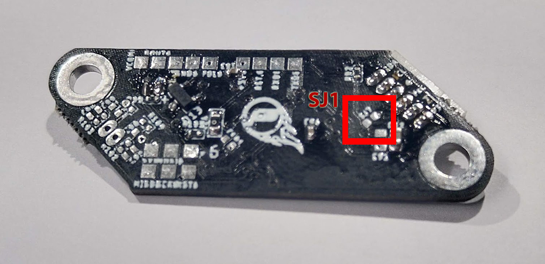

# Unregulated Power Operation with the EasyPiezi

The input voltage regulator built into the EasyPiezi module has a rated input voltage range from **6V and 40V**. There may be some installations that require providing only 3.3V or 5V operation. This is still possible with the EasyPiezi, but requires bridging two pads with solder or conductive tape. This Bypass Solder Brige is labeled SJ1 on the bottom of the board, and can be seen highlighted in the below image:

Simply add some solder between the two pads of SJ1 to bypass the input regulator.

---

## Safety precaution for Unregulated Operation

Bypassing the regulator comes with certain risks. Please be aware that operating the sensor in this mode effectively disables the majority of overvoltage protection built into this device. It's recommmended to add a 10-22uF electrolytic capacitor to the wiring harness between the power and ground terminals to reduce the liklihood of an overvoltage spike that would cause damage to the sensor. Any sustained input voltage above 5.2V will irrepairably damage the sensor module.
